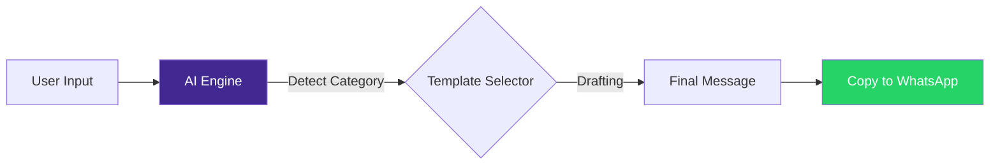

# 💬 WhatsApp CRM Message Generator

<div align="center">
  
  
  
</div>

<br />

An AI-powered tool designed to streamline professional communication on WhatsApp. This CRM tool automatically generates polished, context-aware messages using smart templates and AI category detection.

---

## 🔄 Application Flow



---

## 🌟 Key Features
- **🤖 AI Categorization**: Automatically identifies message intent (e.g., Sales, Support, Intro).
- **📋 Smart Templates**: Pre-configured professional templates for common scenarios.
- **⚡ One-Click Copy**: Instantly copy generated messages for WhatsApp usage.
- **🖥️ Responsive UI**: Clean and minimal dashboard for distraction-free work.

## 🛠️ Installation
1. **Clone the repository**:
   ```bash
   git clone https://github.com/Kodge0001/whatsapp-crm-message-generator-.git
   ```
2. **Install dependencies**:
   ```bash
   pip install -r requirements.txt
   ```
3. **Set up your API Key**:
   Create a `.env` file and add your OpenAI API key:
   ```env
   OPENAI_API_KEY=your_key_here
   ```
4. **Run the application**:
   ```bash
   python app.py
   ```

## 🚀 Usage
Open `http://localhost:5052` in your browser to start generating messages.

---
*Developed by [Anurag Kodge](https://github.com/Kodge0001)*
